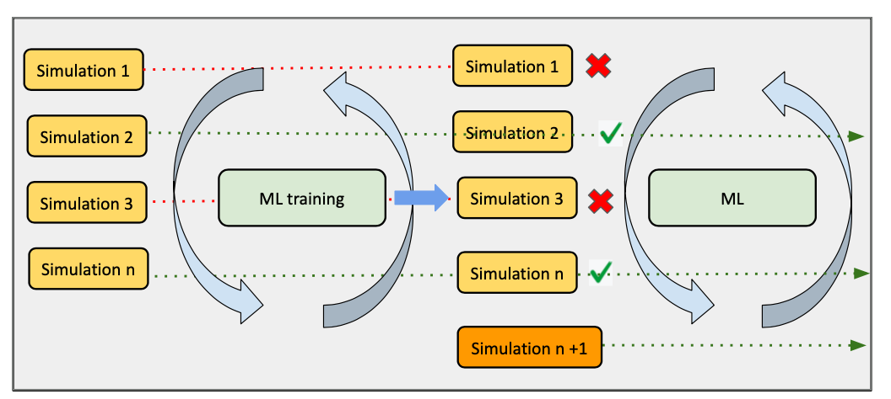

# AI-steered adaptive MD ensemble with DeepDriveSim, AsyncFlow, and Rhapsody

Real molecular dynamics (MD) campaigns face a hard resource challenge: 
you cannot know in advance which trajectories will explore scientifically interesting 
regions of configuration space, yet every GPU spent on a dead-end trajectory 
is one that could be running a more productive simulation.

**DeepDriveSim (DDS)** solves this with a closed AI-in-the-loop cycle.
An ML surrogate model is trained on completed trajectories and then used to
score *running* simulations. Simulations predicted to be low-utility are
cancelled, their resources are immediately freed, and new simulations are
launched in their place — all without human intervention.



This example shows how DDS integrates with two other SINAPSE SDK components:

- **[AsyncFlow](https://github.com/radical-cybertools/radical.asyncflow)** —
  `WorkflowEngine` wraps the backend and exposes `@flow.executable_task`, the
  decorator that turns an async Python function into a distributable HPC task.
- **[Rhapsody](https://github.com/radical-cybertools/rhapsody)** — supplies the
  execution backend: `ConcurrentExecutionBackend` for a laptop and
  `DragonExecutionBackend` for Dragon-managed HPC nodes.

## Prerequisites

Clone the repository and install it in development mode:

```sh
git clone https://github.com/radical-collaboration/DeepDriveSim.git
cd DeepDriveSim
pip install -e '.[dev]'
```

No GPU or HPC account is needed for the tutorial — the `DummyWorkflow` uses
lightweight shell scripts to simulate the full control loop.

## How the control loop works

Every DDS workflow is a subclass of `DDSimManager`.  The base class implements
`start()`, which drives the following loop until a subclass sets
`run_workflow = False`:

```
while run_workflow:
    # 1. Fill simulation slots up to sim_batch_size
    launch sims from sim_task_queue

    # 2. Wait for at least one sim to finish
    await asyncio.sleep(sleep_time)

    # 3. Train when enough data has accumulated
    if check_train_status() and retrain_model:
        if free_resources_for_train:
            pause running sims          # yield GPU/CPU slots
        train_model()

    # 4. Score running sims; cancel the low-utility ones
    if call_evaluate_simulations:
        evaluate_simulations()          # populates sim_predictions
        for sim_idx, score in sim_predictions.items():
            if stop_simulation(prediction=score):
                cancel sim
                add_sims_to_queue([sim_idx])   # re-queue for a fresh start

    # 5. Check stopping condition
    if call_finalize_results:
        finalize_results()              # sets run_workflow=False when done
```

The **key insight** is in step 4: a cancelled simulation immediately returns its
resources to the pool, and a new simulation starts in its slot — all within the
same asyncio event loop tick, without waiting for a scheduler allocation.

## Key abstractions

| Concept             | Class / attribute                                       | Role                                                     |
|---------------------|---------------------------------------------------------|----------------------------------------------------------|
| Control loop        | `DDSimManager.start()`                                  | Drives the adaptive cycle                                |
| Execution backend   | `ConcurrentExecutionBackend` / `DragonExecutionBackend` | Runs tasks locally or on HPC                             |
| Workflow engine     | `WorkflowEngine`                                        | Wraps the backend; exposes `@flow.executable_task`       |
| Pending simulations | `sim_task_queue`                                        | `asyncio.Queue` of inputs not yet started                |
| Running simulations | `registered_sims`                                       | `{sim_idx: asyncio.Task}` in-flight                      |
| Concurrency budget  | `sim_batch_size`                                        | Max simultaneous tasks (sims + training)                 |
| Prediction scores   | `sim_predictions`                                       | `{sim_idx: score}` populated by `evaluate_simulations()` |

### Methods a subclass must implement

| Method                       | Purpose                                                  |
|------------------------------|----------------------------------------------------------|
| `init_sim_queue()`           | Populate `sim_task_queue` with simulation inputs         |
| `check_train_status()`       | Return `True` when enough data exists to start training  |
| `train_model()`              | Run one training iteration (can pause sims first)        |
| `evaluate_simulations()`     | Run inference; write results to `sim_predictions`        |
| `stop_simulation(**kw)`      | Return `True` to cancel a running sim by its score       |
| `add_sims_to_queue(ids)`     | Re-queue cancelled/paused sims                           |
| `post_process_sim(sim_idx)`  | Per-sim cleanup after completion                         |
| `finalize_results()`         | Called every iteration; set `run_workflow=False` to stop |
| `close()`                    | Graceful shutdown                                        |

## Running the tutorial workflow

`DummyWorkflow` replaces real MD and ML code with fast shell scripts so the
full loop runs on any machine:

```python
from radical.asyncflow import WorkflowEngine
from rhapsody.backends import ConcurrentExecutionBackend
from workflows.dummy_workflow.dummy_workflow import DummyWorkflow

config = {
    "engine":                   "concurrent",
    "home_dir":                 "/tmp/ddsim_tutorial",
    "num_inputs":               6,    # total simulation inputs to process
    "max_sim_batch":            3,    # max concurrent simulations
    "training_cores":           1,    # cores reserved for the training task
    "start_training_threshold": 2,    # start training after 2 sims complete
    "training_threshold":       0.5,  # stop retraining once accuracy ≥ 0.5
    "prediction_threshold":     0.5,  # cancel sims with score < this
    "training_epochs":          1,
    "sleep_time":               1,    # seconds between main-loop polls
}

async def run():
    # 1. Create the backend — asyncio process pool, no HPC needed
    engine = await ConcurrentExecutionBackend()
    asyncflow = await WorkflowEngine.create(engine)

    workflow = DummyWorkflow(config=config, asyncflow=asyncflow)
    try:
        await workflow.start()   # drives the full simulate→train→evaluate loop
    finally:
        await workflow.close()
        await asyncflow.shutdown()

await run()
```

`prediction_threshold` is the key parameter: any running simulation whose
surrogate score falls below it is cancelled and its slot is immediately
reassigned to a new simulation from `sim_task_queue`.

## Plugging in a real MD code

Subclass `DummyWorkflow` (or `DDSimManager` directly) and override
`register_tasks()` to build the shell command for your executable.
AsyncFlow's `@flow.executable_task` decorator turns the returned command string
into a task that the backend submits and tracks:

```python
class MyMDWorkflow(DummyWorkflow):

    def register_tasks(self):

        @self.flow.executable_task
        async def simulation(task_description=None, **kwargs):
            sim_idx = kwargs["sim_inputs"]["sim_idx"]
            return (
                f"python run_openmm.py "
                f"--input  {self.sim_inputs[sim_idx]} "
                f"--output {self.sim_output_dir}/{sim_idx}"
            )

        self.simulation = simulation
        # register train, predict the same way …
```

Override `train_model()` to call your ML training script, and
`evaluate_simulations()` to run inference and populate `self.sim_predictions`
with `{sim_idx: score}` pairs.  The base class handles the rest of the loop.

## Switching to HPC (Dragon backend)

On a Dragon-enabled HPC cluster, replace the backend — the workflow code is
unchanged:

```python
from rhapsody.backends import DragonExecutionBackend

engine = await DragonExecutionBackend()
asyncflow = await WorkflowEngine.create(engine)
workflow = MyMDWorkflow(config=config, asyncflow=asyncflow)
await workflow.start()
```

Submit via Dragon instead of Python:

```sh
dragon run_workflow.py --config_file config.yaml
```

A ready-made SLURM script is provided at
`workflows/dummy_workflow/delta_cpu_sbatch.sh` for NCSA Delta.
`DragonExecutionBackend` supports `await` construction — `await DragonExecutionBackend()`
starts the Dragon runtime and returns a ready backend.

## What the adaptive loop delivers

Without adaptation, every simulation runs to completion regardless of quality.
With DDS, the surrogate model acts as an early-warning filter:

| Aspect                       | Without DDS                  | With DDS                                          |
|------------------------------|------------------------------|---------------------------------------------------|
| Low-utility trajectories     | Run to completion            | Cancelled as soon as score drops below threshold  |
| GPU/CPU resources            | Held by unproductive runs    | Freed immediately and reassigned                  |
| Configuration space coverage | Uniform, blind               | Focused on high-information regions               |
| Surrogate quality            | Static (pre-trained or none) | Improves every training round as more data arrives |

The loop continues until `finalize_results()` determines that all useful
simulation work is done — either a target number of completions, a model
accuracy threshold, or both.
